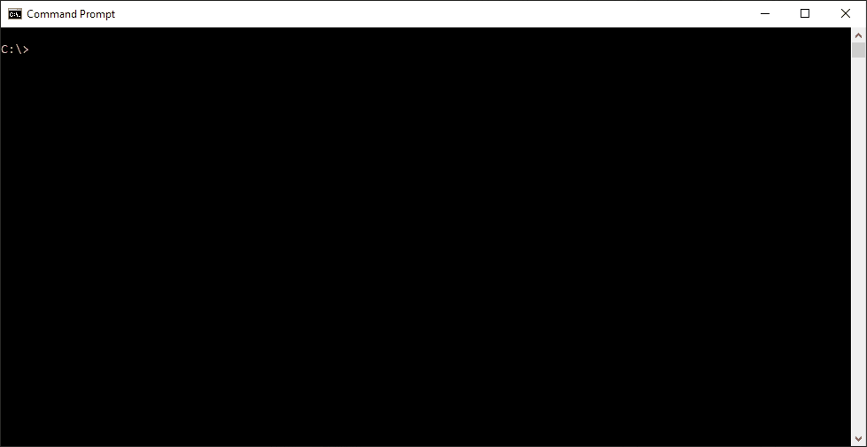

# nRF Util

## DEPRECATION NOTICE
This tool is deprecated. The feature set in this tool is available through a new tool with the same name.
If you need the feature set in this version, please install the new nrfutil from the [official page](https://www.nordicsemi.com/Products/Development-tools/nrf-util).

## Intro
nRF Util is a Python package and command-line utility that supports Device Firmware Updates (DFU) and cryptographic functionality.

## Documentation

See the [InfoCenter](https://infocenter.nordicsemi.com/topic/ug_nrfutil/UG/nrfutil/nrfutil_intro.html) pages for information on how to install and use nRF Util.

## Feedback

Please report issues on the [DevZone](https://devzone.nordicsemi.com) portal.

## Contributing

Feel free to propose changes by creating a pull request.

If you plan to make any non-trivial changes, please start out small and ask seek an agreement before putting too much work in it. A pull request can be declined if it does not fit well within the current product roadmap.

In order to accept your pull request, we need you to sign our Contributor License Agreement (CLA). You will see instructions for doing this after having submitted your first pull request.

## License

See the [LICENSE](LICENSE) file for details.
